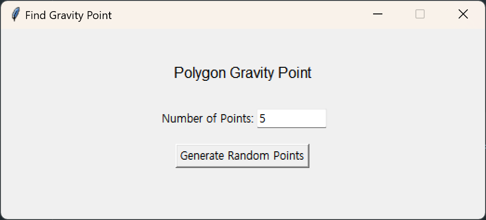
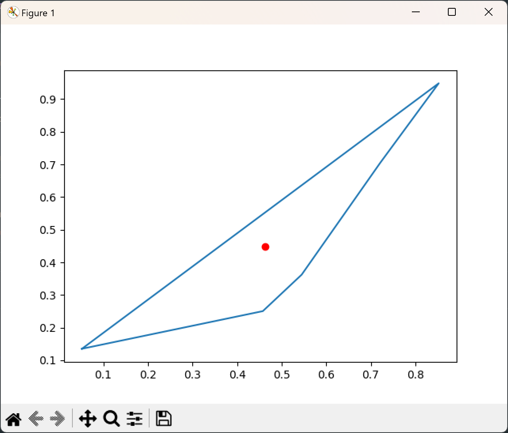

# 다각형의 무게중심 찾기
- - -
## 출력 예시
</img>

</img>
- - -
## 상세 원리
### 1. __연립일차방정식__ 의 해 구하기
- __*가우스-조던 소거법*__ 이용

1. 첨가행렬로 연립일차방정식을 나타낸다
 ex) x+2y=5, 2x+3y=8 →
 [1 2 5]
 [2 3 8]

2. 행끼리 상수배하고 더하거나 빼서 기약행 사다리꼴을 만든다
 ex)
 [1,2,5]← 2배하여 뺌(알맞게 설정)
 [2,3,8]
 -------------------------------------------
 [1,2,5]
 [2- 1(×2),3- 2(×2),8- 5(×2)] → ×(-1)
 -------------------------------------------
 [1,2,5]
 [0,1,2] ← 2배하여 뺌(알맞게 설정)
 -------------------------------------------
 [1,0,1]
 [0,1,2] → 연립방정식으로 표현
 -------------------------------------------
 __∴x=1,y=2__

### 2. 주어진 점들 반시계방향으로 정렬하기
- __*arctan*__ 함수 이용

1. 모든 점들의 중심점을 구한다.
2. x축의 양의 방향을 기준으로 중심점에서 각 점까지의 기울기를 구한다.
 (-180º~180º)
3. 기울기가 작은 순서대로 배열한다.
- - -
#### _Credit_
- 최지완
- 최현우
- 김이겸
- 이주원
- 이강
